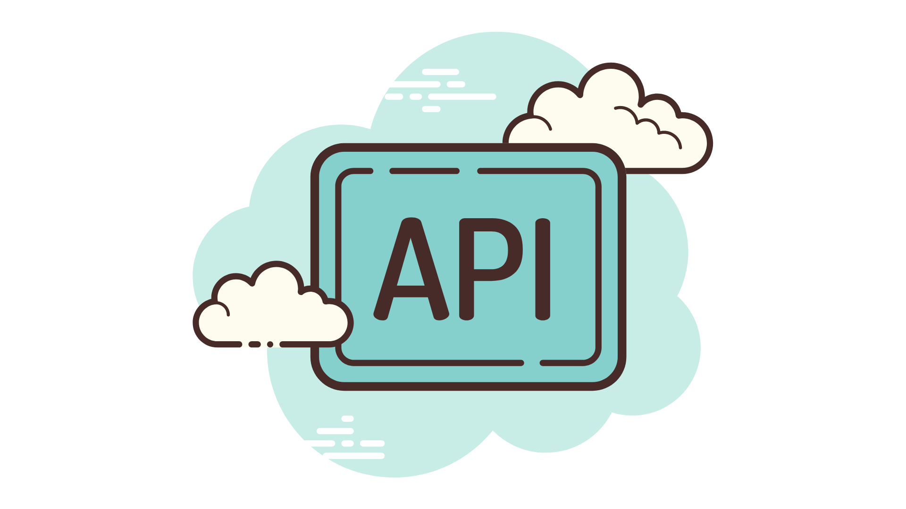

# Ranjit Kumar Yadav's Portfolio

## Introduction

This Streamlit web application serves as the portfolio for Ranjit Kumar Yadav, a Python programmer and Full Stack Developer currently working at Cognizant. It showcases some of his projects along with a brief introduction about himself.

## About Ranjit Kumar Yadav

Ranjit is a Python programmer and Full Stack Developer with expertise in developing web applications using Python and related technologies. He graduated in 2022 with a Bachelor of Technology in Computer Science and also holds a three-year diploma in Computer Science Engineering.

At Cognizant, Ranjit contributes to various software projects, leveraging his skills in both front-end and back-end development.

## Projects

### 1. Todo App
A distraction-free web app to help you focus on creating and completing tasks.

[Source Code](https://pythonhow.com)

### 2. Portfolio Website
A website built entirely in Python to showcase coding projects and apps.

[Source Code](https://pythonhow.com)

### 3. PDF Templates
A script that generates PDF templates of multiple pages given some predefined guidelines.

[Source Code](https://pythonhow.com)

### 4. Positive News Site
A website that gets data from a news API and uses sentiment analysis to publish only positive news.

[Source Code](https://pythonhow.com)

### 5. Weather API
A REST API built with Python and Flask to serve historical weather data for various cities.

[Source Code](https://pythonhow.com)

### 6. Visualizing Weather Forecast
A data web app that visualizes the weather forecast for the next five days of any city.

[Source Code](https://pythonhow.com)

### 7. Restaurant Menu Web App
A Django web app to let customers see a restaurant menu and meal availability.

[Source Code](https://pythonhow.com)

### 8. Online Store
A Django online store app where users can place orders and sellers can manage them.

[Source Code](https://pythonhow.com)

## Contact

Feel free to contact Ranjit Kumar Yadav for any inquiries or collaboration opportunities.

## How to Run

To run this Streamlit app locally, follow these steps:

1. Clone this repository.
2. Install the required dependencies by running `pip install -r requirements.txt`.
3. Run the Streamlit app using `streamlit run app.py`.

## License

This project is licensed under the MIT License - see the [LICENSE](LICENSE) file for details.
